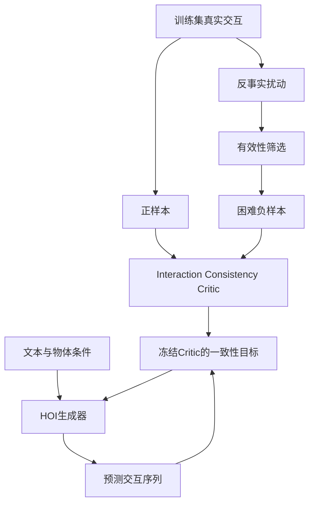

# CounterHOI

**Learning 3D Human-Object Interaction Generation from Counterfactual Interactions**

通过构造有针对性的错误人–物交互样本，研究能否改善三维人–物交互（3D HOI）生成中的**交互一致性**与**组合泛化能力**。

> **当前状态：项目规划 / 早期复现阶段。**  
> 本仓库记录三人、四周的研究原型实施方案。目前不代表已完成代码、训练或实验。ViHOI 暂定为主基线，OMOMO 暂定为首个数据集；官方代码、权重、数据适配、许可证与训练资源均须在第一周核实。下文所有性能提升均为待验证假设，不是已有结果，也不构成论文录用承诺。

---

## 1. 项目目标与研究问题

计划输入文本描述与物体几何表示，输出人体运动、物体运动及其交互序列；具体输入约束以核实后的基线接口为准。

核心研究问题：

> **在正确示范之外，显式学习经过有效性筛选的错误交互，能否帮助模型减少交互错误，并泛化到训练时未出现的动作–物体组合？**

例如，在需要持续抓持的搬运片段中，模型可能生成：

```text
手已经离开物体
        ↓
但物体仍继续随人体向上移动
```

这类序列从局部运动上可能仍然平滑，但在人–物交互关系上是不成立的。

CounterHOI 不只学习：

```text
什么是正确交互
```

还尝试学习：

```text
什么是“看起来接近正确，但实际上交互错误”的样本
```

因此，本项目真正想研究的是：

> **模型能否通过受控错误样本学习“交互失败边界（interaction failure boundary）”。**

四周目标是完成可复现的研究原型、核心对照实验与论文初稿。是否继续面向 CVPR 等会议扩展，由相关工作核查和实验结果决定；模块数量与代码行数不作为研究价值的证据。

---

## 2. 研究范围

| 项目 | 计划 |
| --- | --- |
| 主基线 | ViHOI，第一周验证代码、权重、训练与评估入口 |
| 数据 | OMOMO 优先，验证与基线的数据格式、文本标注兼容性 |
| 核心思想 | Interaction-specific Counterfactual Supervision |
| 核心模块 | 反事实样本构造、Interaction Consistency Critic、组合泛化评估 |
| 辅助模块 | Difficulty-Aware Curriculum |
| 核心评估 | 交互一致性、未见动作–物体组合、真实生成错误上的 Critic 泛化 |
| 团队与周期 | 3 人，4 周，以阶段验收决定是否继续 |
| 算力 | RTX 4090 优先开发；显存与训练时长实测后再决定是否使用 A100 |
| 最终产出 | 代码、数据构造工具、划分清单、模型权重（许可允许时）、实验记录、对比视频、论文初稿 |

本轮不做：

- 新扩散骨干；
- VLM / Foundation Model 重训练；
- 多物体交互；
- 关节物体；
- 物理仿真控制；
- 真实机器人部署；
- 完整跨数据集训练。

第二数据集、更强 baseline 和更多 unseen object 只作为后续扩展目标。

---

## 3. 整体技术路线



项目围绕三个主要研究部分展开：

1. **Counterfactual Interaction Generation**
2. **Interaction Consistency Critic**
3. **Compositional Generalization Evaluation**

Difficulty-Aware Curriculum 作为辅助实验，不作为主要创新点。

---

## 4. 反事实交互构造

从训练集真实运动出发，只改变有限的交互因素，尽量保留其他条件。

这里的“反事实”指：

> **受控扰动得到的错误交互样本。**

不主张已经建立严格的因果识别模型。

反事实样本必须同时满足：

```text
1. 局部运动仍然看起来合理
2. 人–物交互关系被破坏
```

如果负样本本身存在非常明显的拼接、速度突变或姿态异常，Critic 可能只是在学习“坏动画”，而不是学习交互规律。

---

### 4.1 Premature Release

在需要持续抓持、支撑或搬运的阶段，提前打断手–物接触，但保留部分物体原始运动。

例如：

```text
原始：

手持续接触
──────────────

物体持续被搬运
──────────────
```

构造后：

```text
手接触
──────

物体仍继续被搬运
──────────────
```

适用条件：

- 必须是需要持续接触的交互阶段；
- 排除正常投掷；
- 排除合法释放；
- 排除自由落体；
- 排除本来就允许脱离接触的动作。

---

### 4.2 Object Motion Without Required Contact

改变人体与物体的相对时序或相对位置，使物体在缺少必要人体接触时仍保持原本的受控运动。

例如：

```text
手已经远离物体
        ↓
物体仍继续跟随人体移动
```

必须排除：

- 惯性运动；
- 滚动；
- 滑动；
- 自由落体；
- 外部支撑；
- 投掷；
- 合法释放后的运动。

因此，这类样本必须依赖 interaction phase 和有效性筛选。

---

### 4.3 Spatial Contact Shift

改变手与物体之间的相对位置，使手接触或接近一个与当前交互不一致的位置。

例如：

```text
原始：
hand → 有效交互区域

扰动：
hand → 邻近但不合理的区域
```

注意：

> 不能简单认为“不是原始接触位置”就一定错误。

只有在数据或几何关系足以支持“该区域明显不适合当前动作”时，才将其作为确定负例。

---

### 4.4 Wrong Body Part

Wrong Body Part 暂不作为第一优先级。

原因是：

```text
肘部接触 ≠ 一定错误
腿部接触 ≠ 一定错误
非手部接触 ≠ 一定错误
```

它高度依赖具体动作语义。

如果没有足够可靠的动作语义依据，不为凑齐扰动类型强行加入该类别。

---

## 5. 反事实有效性筛选

所有负样本都必须经过有效性检查。

建议检查：

```text
运动连续性
速度连续性
异常加速度
人体–物体距离
穿透
接触持续时间
物体支撑状态
Interaction Phase
```

每个样本需要保存：

```json
{
  "source_id": "...",
  "corruption_type": "premature_release",
  "severity": 0.35,
  "seed": 42,
  "validity": true
}
```

建议额外记录：

```text
action_label
object_category
interaction_phase
contact_frames
corruption_parameters
filter_reason
```

必须进行人工抽查，并将样本分为：

```text
有效负例
无效负例
不确定
```

不确定样本不作为确定负例。

---

## 6. Interaction Consistency Critic

第二个核心模块是 **Interaction Consistency Critic**。

Critic 输入可包括：

```text
人体运动
物体运动
人体–物体相对几何
Contact 特征
文本 / 动作条件
```

第一版优先使用轻量时序模型，例如：

```text
Temporal Transformer
TCN
GRU
Temporal MLP
```

本项目不以堆大模型为目标。

核心问题是：

> **反事实错误监督本身是否包含有价值的交互信息？**

---

### 6.1 Critic 训练目标

第一版使用二分类：

```text
正确交互 → 1
反事实错误交互 → 0
```

候选损失：

```text
L_critic = BCE(C(x), y)
```

如果正负样本来自同一原始序列，也可以增加 ranking：

```text
C(x_positive) > C(x_counterfactual)
```

---

### 6.2 Critic 必须测试什么

Critic 不能只看训练集准确率。

必须包含：

1. 独立原始序列上的正负样本；
2. 未见过的 corruption severity；
3. 如果数据允许，测试未见 corruption type；
4. 未见动作–物体组合；
5. 最重要：**基线模型真实生成的错误样本。**

最关键的实验是：

```text
训练：
synthetic counterfactual errors

测试：
real generator errors
```

如果 Critic 在人工生成负样本上很高，但对真实生成错误无效，说明它可能只学到了扰动痕迹。

---

### 6.3 简单规则对照

必须实现 rule-based baseline，例如：

```text
hand-object distance threshold
contact duration threshold
unsupported object velocity
penetration threshold
```

这个实验回答：

> 为什么一定需要 Learned Critic？

如果简单规则与 Critic 表现相近，则需要重新评估 Critic 的研究价值。

---

## 7. Critic 如何影响生成器

主路线：

1. 先训练 Critic；
2. 冻结 Critic 参数；
3. 将生成器预测结果输入 Critic；
4. 使用一致性目标优化生成器。

候选目标：

```text
L_total = L_generation + λ · L_consistency
```

其中：

```text
L_consistency =
    -log(sigmoid(C(predicted_motion, condition)))
```

具体实现必须根据 ViHOI 的预测参数化确认。

第一版必须验证：

- Critic 参数被冻结；
- 梯度仍然可以传回生成器；
- 不出现 accidental detach；
- 几何特征尽量使用可微距离；
- 不通过硬阈值截断训练梯度；
- 保留原始 generation loss；
- 检查 motion quality、text alignment 和 diversity 是否下降。

---

## 8. Reranking 降级方案

如果第三周仍无法稳定进行 gradient-based integration，则采用固定候选数的 Critic reranking。

例如：

```text
同一个 condition
        ↓
Generator
        ↓
candidate 1
candidate 2
candidate 3
candidate 4
        ↓
Critic score
        ↓
选择最高分结果
```

但必须明确：

```text
reranking improvement
≠
generator learning improvement
```

如果使用 reranking，只能声称：

> Critic 能帮助候选选择。

不能声称生成器本身已经学会了更好的 interaction consistency。

---

## 9. 组合泛化协议

第三个主要研究部分是：

> **Compositional Generalization**

问题是：

> 当 action 和 object 分别在训练中出现过，但它们的组合没有出现过时，CounterHOI 是否仍然有帮助？

---

### 9.1 Action × Object Matrix

第一周需要统计：

```text
             box   bottle   chair   bag
lift          ✓       ×       ×      ✓
hold          ✓       ✓       ×      ✓
move          ✓       ✓       ✓      ×
place         ✓       ✓       ✓      ✓
```

然后根据真实数据覆盖选择 unseen pairs。

---

### 9.2 Unseen Pair 定义

一个合法的 unseen pair 必须满足：

```text
action ∈ training actions

object ∈ training objects

(action, object) ∉ training pairs
```

例如：

```text
训练：

lift + box
hold + bottle
move + bottle

测试：

lift + bottle
```

也就是说：

```text
lift 见过
bottle 见过

但 lift + bottle 没见过
```

---

### 9.3 数据泄漏要求

必须遵守：

1. 先按原始序列划分，再切时间窗口；
2. negative sample 必须在划分之后生成；
3. 相邻窗口不能跨 train / val / test；
4. normalization 统计量只使用 train；
5. corruption threshold 与 curriculum 参数只能由 train / val 决定；
6. 检查 pretrained weight 是否可能见过目标 test pair；
7. 无法排除时必须在论文中明确披露。

如果 OMOMO 的组合覆盖不足，则缩小结论范围，不强行制造不可靠的 unseen split。

---

## 10. Difficulty-Aware Curriculum

反事实样本可以按照难度组织。

难度可参考：

```text
扰动幅度
错误持续时间
距离有效接触的偏差
时间偏移
Critic confidence
```

候选课程：

| 阶段 | 样本 |
| --- | --- |
| 前期 | 简单负例为主 |
| 中期 | 简单 + 中等 |
| 后期 | 简单 + 中等 + 困难 |

但 Curriculum 只作为辅助技术。

主要实验必须是：

```text
同一个 negative pool
相同训练步数
尽可能相同样本曝光量

Random Mixing
vs
Difficulty Curriculum
```

避免把额外训练量误认为 curriculum 的收益。

---

## 11. 实验与评估

最终评估必须尽量独立于训练 Critic。

不能直接拿 Critic 自己的分数证明：

```text
“我们的方法生成得更好”
```

---

### 11.1 最小实验矩阵

| 实验 | 比较内容 | 回答的问题 |
| --- | --- | --- |
| Baseline | 原始生成器 | 基础参考 |
| Main Result | Baseline vs CounterHOI | 完整方法是否改善生成？ |
| Rule Baseline | 简单规则 vs Learned Critic | Critic 是否真的必要？ |
| Negative Design | Random corruption vs interaction-aware corruption | 定向负样本是否有效？ |
| Critic Guidance | No Critic vs Critic | Critic 是否真正影响生成？ |
| Curriculum | Random Mixing vs Curriculum | Curriculum 是否有效？ |
| Seen / Unseen | Seen Pair vs Unseen Pair | 是否改善组合泛化？ |
| Critic Transfer | Synthetic Error vs Generator Error | Critic 是否学到真实交互规律？ |

---

### 11.2 指标

| 维度 | 计划指标 | 注意事项 |
| --- | --- | --- |
| 生成质量 | 沿用核实后的 baseline 官方指标 | 相同数据与评估器 |
| 接触一致性 | Contact Precision / Recall / F1 | 不把唯一参考接触当作唯一正确答案 |
| 交互错误 | Premature Release Rate | 明确 interaction phase |
| 交互错误 | Unsupported Object Motion Rate | 排除合法无接触运动 |
| 时间一致性 | Contact Duration Error | 只用于可对齐片段 |
| Critic | AUROC / Balanced Accuracy | 独立序列与真实生成错误 |
| 泛化 | Seen / Unseen Pair | 报告样本数与预训练暴露情况 |

几何接触如果是根据距离阈值推导，只能称为 pseudo-label / geometric contact estimate，不能直接称为 ground-truth contact。

必须记录：

```text
距离单位
阈值
帧率
坐标系
```

并根据需要做阈值敏感性实验。

---

# 12. 三人分工

为了避免原来的任务串行依赖，重新调整为：

- **A：Generation / Baseline Lead**
- **B：Counterfactual / Critic Lead**
- **C：Evaluation / Generalization Lead**

大致工作量：

```text
A ≈ 35%
B ≈ 35%
C ≈ 30%
```

---

## 12.1 A：Generation / Baseline Lead

主要负责：

> 跑通 HOI 生成器，并完成 Critic 与生成器之间的集成。

### Week 1

- 核实 ViHOI 官方论文与仓库；
- 核实 license；
- 核实 pretrained weights；
- 跑通 inference；
- 跑 short training；
- 测显存；
- 测运行速度；
- 确认输入 / 输出 representation；
- 定位 generator loss；
- 定位 prediction parameterization。

交付：

```text
reports/baseline_reproduction.md
```

---

### Week 2

实现生成器侧接口：

```text
training/consistency_loss.py
```

必须验证：

```text
Critic frozen
Generator 有 gradient
Loss finite
No accidental detach
```

A 不负责 Critic 本身的训练。

---

### Week 3

接入 B 的 Critic。

运行：

```text
Baseline

Baseline + Critic Loss

Baseline + Critic Reranking
```

如果 gradient integration 不稳定，则切换到 reranking fallback。

---

### Week 4

完成主要 generator experiment。

交付：

```text
checkpoints
configs
training logs
inference scripts
comparison sequences
failure cases
```

---

## 12.2 B：Counterfactual / Critic Lead

主要负责：

> 完成反事实错误样本系统，并训练 Interaction Consistency Critic。

---

### Week 1

审计 OMOMO：

```text
action labels
object categories
sequence IDs
frame rate
coordinate system
human representation
object representation
text annotations
contact information
```

实现：

```text
contact extraction
contact visualization
```

---

### Week 2

优先实现：

```text
Premature Release

Object Motion Without Contact

Spatial Contact Shift
```

并实现：

```text
validity filtering
severity control
metadata logging
sample visualization
```

完成分层人工抽查。

冻结：

```text
Counterfactual Dataset v1
```

---

### Week 3

实现并训练 Critic。

测试：

```text
held-out sequences
unseen corruption severity
real generator errors
```

同时实现 rule-based baseline。

交付：

```text
models/interaction_critic.py

counterfactual/

reports/critic_results.md
```

---

### Week 4

运行：

```text
corruption ablation
counterfactual type analysis
difficulty analysis
curriculum experiment
```

将最终 Critic checkpoint 交给 A。

---

## 12.3 C：Evaluation / Generalization Lead

主要负责：

> 构建独立评估系统，并负责 compositional generalization。

C 不再只是“跑指标 + 写论文”。

---

### Week 1

完成 related work 核查：

```text
3D HOI Generation
Contact-Aware Generation
Interaction Guidance
Counterfactual Supervision
Negative Interaction Learning
Compositional Generalization
```

并统计：

```text
action × object frequency matrix
```

生成 unseen pair 候选。

---

### Week 2

实现独立评估：

```text
evaluation/contact_metrics.py
evaluation/interaction_metrics.py
evaluation/rule_based_baseline.py
```

至少包括：

```text
Contact F1
Premature Release Rate
Contact Interruption Rate
Unsupported Object Motion Rate
```

C 的最终评估不能依赖 B 的 Critic score。

---

### Week 3

冻结：

```text
train_pairs.json
val_pairs.json
unseen_pairs.json
```

运行：

```text
Seen Pair Evaluation

Unseen Pair Evaluation

Baseline Evaluation

CounterHOI Evaluation
```

并负责 batch rendering 和错误可视化。

---

### Week 4

完成：

```text
main result table
ablation table
seen/unseen analysis
failure analysis
figures
comparison videos
paper experiment section
```

C 同时负责维护全组的 central experiment table。

---

## 13. 协作接口

### B → A

提供：

```text
critic checkpoint
critic config
critic inference function
counterfactual metadata
```

建议 Critic 接口：

```python
score = critic(
    human_motion,
    object_motion,
    condition
)
```

---

### A → C

统一输出：

```text
sequence_id
condition
method
seed
human_motion
object_motion
checkpoint
config
```

---

### B → C

提供：

```text
source_id
corruption_type
severity
seed
validity
```

C 可以使用这些 metadata 做分析，但不能直接把 Critic 当最终 evaluator。

---

## 14. 建议目录结构

```text
3DHOI/
├── README.md
├── configs/
├── models/
│   └── interaction_critic.py
├── counterfactual/
│   ├── corruptions.py
│   ├── premature_release.py
│   ├── spatial_shift.py
│   ├── unsupported_motion.py
│   ├── validity.py
│   └── difficulty.py
├── datasets/
│   ├── extract_contact.py
│   ├── build_pair_matrix.py
│   └── compositional_split.py
├── training/
│   ├── consistency_loss.py
│   └── curriculum_sampler.py
├── evaluation/
│   ├── contact_metrics.py
│   ├── interaction_metrics.py
│   ├── critic_metrics.py
│   ├── rule_based_baseline.py
│   └── compositional_eval.py
├── visualization/
├── splits/
│   ├── train_pairs.json
│   ├── val_pairs.json
│   └── unseen_pairs.json
├── tests/
└── reports/
```

---

## 15. Git 开发流程

建议分支：

```text
main

baseline-generator
counterfactual-critic
evaluation-generalization
```

对应：

```text
A → baseline-generator
B → counterfactual-critic
C → evaluation-generalization
```

不要多人长期直接修改同一核心文件。

每个 Codex 任务限制为一个可验收模块：

```text
明确接口
    ↓
实现
    ↓
必要测试
    ↓
真实运行
    ↓
人工检查
    ↓
提交
```

每次任务报告记录：

```text
修改文件
运行命令
实际输出
PASS / FAIL
已知问题
```

---

## 16. 实验可复现要求

每次实验保存：

```text
Git commit
Dataset version
Split version
完整 config
Random seed
GPU
Training steps
Runtime
Checkpoint path
Evaluation command
Result path
```

不要把未真实跑出的数字写进 README。

不要提交：

```text
受限数据
密钥
未经许可的模型文件
```

---

## 17. 四周时间表

### Week 1：复现与可行性

#### A

```text
ViHOI reproduction
short training
generator interface audit
```

#### B

```text
OMOMO audit
contact extraction
counterfactual feasibility
```

#### C

```text
official evaluation
action-object matrix
related-work audit
```

### Week-1 Gate

只有以下全部通过，才继续大规模开发：

```text
baseline inference works
short training works
dataset loads correctly
evaluation runs
data interfaces understood
```

如果 baseline 没跑通，暂停新模块，优先解决 blocker。

---

### Week 2：Counterfactual Pipeline

#### A

```text
consistency loss interface
gradient-flow tests
generator hook
```

#### B

```text
counterfactual generation
validity filtering
manual inspection
Critic dataset
```

#### C

```text
independent metrics
rule-based baseline
generalization split draft
```

阶段目标：

```text
Positive HOI
+
Validated Counterfactual HOI
+
Independent Metrics
```

---

### Week 3：核心方法

#### A

```text
Critic integration
generator experiment
reranking fallback
```

#### B

```text
Critic training
Critic generalization
synthetic → real error evaluation
```

#### C

```text
Seen / Unseen Pair evaluation
batch rendering
initial result table
```

阶段目标：

```text
Baseline
vs
CounterHOI
```

必须有真实定量与定性结果。

---

### Week 4：消融与论文原型

停止继续加大型新模块。

重点：

```text
实验
分析
failure case
可视化
写作
```

必须优先完成：

```text
Baseline

Full CounterHOI

Random corruption

Rule-based interaction constraint

No curriculum / curriculum

Seen / unseen pairs

Synthetic / real Critic errors
```

如果资源允许，再做：

```text
corruption type ablation
multiple random seeds
second dataset
additional baseline
```

---

## 18. 最低完整原型

最低完整原型必须包含：

```text
1. 可复现 HOI baseline

2. 经过验证的 interaction-specific counterfactual samples

3. Interaction Consistency Critic

4. 独立 interaction evaluation

5. 至少一种 Critic 真正影响输出的方法

6. Seen / Unseen compositional evaluation

7. Baseline 与核心 ablation
```

只有 Critic 分类准确率高：

```text
不够
```

必须证明：

> **它能够影响最终 HOI generation。**

---

## 19. 失败风险

### Failure A：Critic 只学到扰动痕迹

表现：

```text
synthetic negative 很高

但

real generator error 很差
```

说明 Critic 可能没学到 interaction consistency。

处理：

```text
减少明显扰动痕迹
增加 hard negatives
改进 validity filtering
```

---

### Failure B：简单规则已经足够

如果：

```text
distance threshold
≈
learned Critic
```

则需要重新评估 Critic 是否值得保留。

优先尝试：

```text
更难的时序错误
```

而不是简单增加模型大小。

---

### Failure C：Critic 改善交互但破坏动作质量

表现：

```text
interaction consistency ↑

但

motion quality ↓
```

处理：

```text
降低 lambda
只在 interaction phase 使用 loss
使用 reranking
```

---

### Failure D：Unseen Pair 数量不足

如果 OMOMO 无法支持可靠 compositional split：

```text
不要硬做
```

可以：

```text
缩小 claim
```

或后续引入第二数据集。

---

## 20. Demo

最终对比视频应在相同条件下比较：

```text
Text:
"Lift the bottle and move it to the table"
```

展示：

```text
Baseline
vs
CounterHOI
```

建议叠加：

```text
人体运动
物体运动
接触点
Contact Timeline
```

视频中必须同时展示：

```text
成功案例
失败案例
Unseen Pair 案例
没有改善的案例
```

避免只 cherry-pick 成功结果。

---

## 21. 论文故事线

论文围绕一个主张展开：

> **3D HOI generator 能否通过显式学习“合理但错误”的交互样本，更好地学习有效交互的边界？**

整体故事：

```text
现有生成器主要学习正确交互
        ↓
生成结果可能运动平滑但交互错误
        ↓
构造 interaction-aware counterfactual negatives
        ↓
训练 Interaction Consistency Critic
        ↓
用 Critic 约束 / 选择生成结果
        ↓
测试是否提升真实生成错误
        ↓
测试是否迁移到 unseen action-object composition
```

---

## 22. 候选论文贡献

只有实验支持后，才能正式表述为 contribution。

### Contribution 1

**Counterfactual Interaction Generation**

构造局部运动仍合理、但人–物交互关系被破坏的受控错误样本。

### Contribution 2

**Interaction Consistency Critic**

使用真实交互与反事实交互训练 Critic，并将其用于 HOI generation。

### Contribution 3

**Compositional Generalization Evaluation**

研究 counterfactual supervision 是否能够改善 unseen action-object pair 上的交互表现。

以上目前均是：

```text
research hypothesis
```

不是已经成立的论文贡献。

---

## 23. Novelty Boundary

本项目不要简单声称以下内容是创新：

```text
contact-aware generation
contact loss
physical consistency
human-object distance constraint
Critic guidance alone
curriculum learning alone
```

真正需要保护的创新边界是：

> **Learning from deliberately constructed plausible-but-invalid interactions.**

更具体地说：

> **模型是否能够通过受控错误样本学习一个可泛化的 interaction failure boundary，并迁移到真实生成错误和 unseen action-object combination。**

---

## 24. 撞题监控重点

持续关注：

```text
3D Human-Object Interaction Generation

Human-Object Motion Synthesis

Contact-Aware Motion Generation

Interaction Guidance

Interaction Critic

Negative / Corrupted Interaction Supervision

Counterfactual Motion Learning

Hard Negative Interaction Learning

Compositional HOI Generalization
```

如果出现同时包含以下组合的新工作：

```text
interaction-specific negative construction
+
learned interaction critic
+
generator guidance
+
compositional evaluation
```

应立即重新评估项目的 novelty claim。

---

## 25. Week 1 Checklist

### A

- [ ] 确认 ViHOI 官方论文与仓库
- [ ] 确认 license
- [ ] 下载所需 checkpoint
- [ ] 跑通一次 inference
- [ ] 跑一次 short training
- [ ] 记录 VRAM
- [ ] 记录 runtime
- [ ] 确认 generator loss
- [ ] 确认 prediction representation

### B

- [ ] 确认 OMOMO 数据可用性与 license
- [ ] 检查 sequence structure
- [ ] 检查 action labels
- [ ] 检查 object labels
- [ ] 检查 coordinate system
- [ ] 实现初版 contact extraction
- [ ] 可视化若干 interaction
- [ ] 验证三类 counterfactual 是否可行

### C

- [ ] 跑通官方 evaluation
- [ ] 跑通 rendering
- [ ] 建立 action-object matrix
- [ ] 起草 unseen-pair split
- [ ] 建立 experiment registry
- [ ] 更新 related-work comparison table

### 全员

- [ ] 冻结公共 data interface
- [ ] 冻结文件命名规范
- [ ] 冻结 Week-2 API interface
- [ ] 人工检查 counterfactual validity
- [ ] 决定是否通过 Week-1 feasibility gate

---

## 26. 最终交付

四周原型目标：

```text
可复现 baseline

Counterfactual interaction generator

Counterfactual metadata

Interaction Consistency Critic

Generator integration

Compositional splits

Independent evaluation tools

Experiment configs

Model checkpoints

Quantitative tables

Qualitative comparison videos

Failure analysis

Paper draft
```

---

## 27. 当前状态

```text
[ ] Baseline verified

[ ] Dataset verified

[ ] Evaluation verified

[ ] Counterfactual corruption implemented

[ ] Counterfactual validity tested

[ ] Critic implemented

[ ] Critic trained

[ ] Generator integration completed

[ ] Compositional split frozen

[ ] Core experiments completed

[ ] Ablations completed

[ ] Demo completed

[ ] Paper draft completed
```

---

## 28. 当前研究原则

> **不要为了让项目看起来工作量大而增加模块。每一个模块都必须对应一个明确的研究问题。**

最终 CounterHOI 是否有价值，不看模块数量，而看实验是否支持核心问题：

> **学习“合理但错误”的交互样本，能否真正改善 3D HOI generation，并提升 compositional interaction generalization？**
