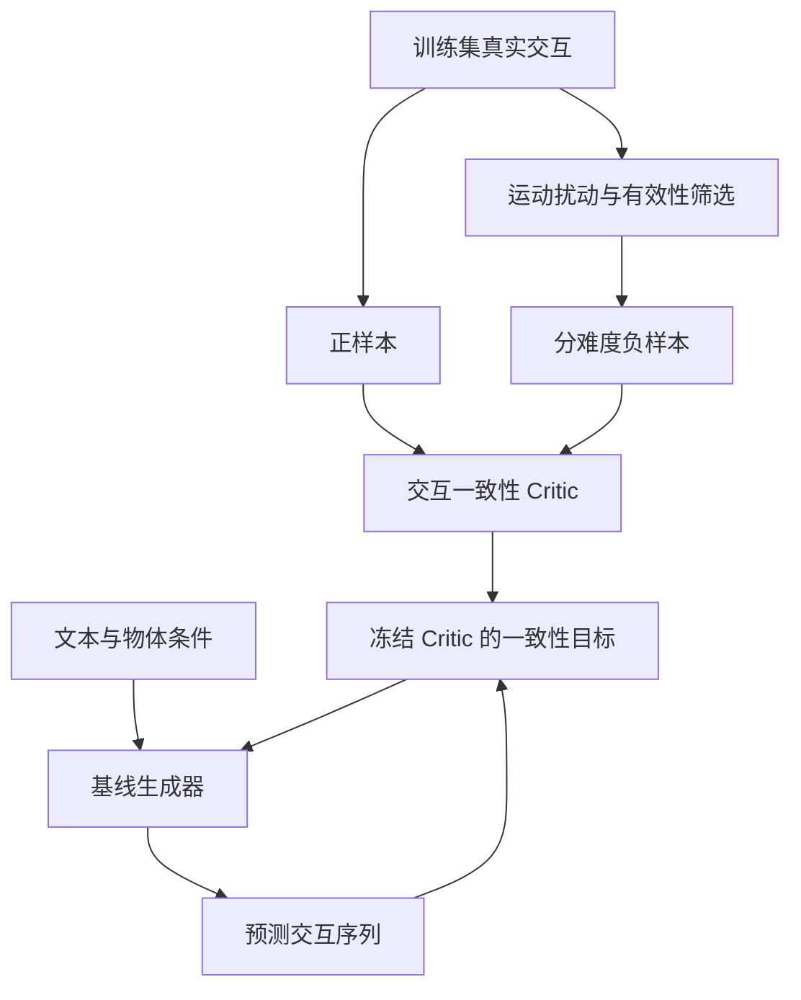

# CounterHOI

**Learning 3D Human-Object Interaction Generation from Counterfactual Interactions**

通过构造有针对性的错误人–物交互样本，研究能否改善三维人–物交互（3D HOI）生成的交互一致性与组合泛化能力。

> **当前状态：项目规划阶段。** 本仓库记录三人、四周的研究原型实施方案。目前不代表已完成代码、训练或实验。ViHOI 暂定为主基线，OMOMO 暂定为首个数据集；官方代码、权重、数据适配、许可证与训练资源均须在第一周核实。下文所有性能提升均为待验证假设，不是已有结果，也不构成论文录用承诺。

## 1. 项目目标与研究问题

计划输入文本描述与物体几何表示，输出人体运动、物体运动及其交互序列；具体输入约束以核实后的基线接口为准。

核心研究问题：

> 在正确示范之外，显式学习经过有效性筛选的错误交互，能否帮助模型减少交互错误，并泛化到训练时未出现的动作–物体组合？

例如，在需要持续抓持的搬运片段中，模型可能生成“手已离开物体，但物体仍持续被抬升”的序列。我们研究学习这类错误是否能够改善生成结果。

四周目标是完成可复现的研究原型、核心对照实验与论文初稿。是否继续面向 CVPR 等会议扩展，由相关工作核查和实验结果决定；模块数量与代码行数不作为研究价值的证据。

## 2. 研究范围

| 项目 | 计划 |
| --- | --- |
| 主基线 | ViHOI，第一周验证代码、权重、训练与评估入口 |
| 数据 | OMOMO 优先，验证与基线的数据格式、文本标注兼容性 |
| 核心模块 | 反事实样本构造、交互一致性 Critic、难度课程训练 |
| 核心评估 | 交互一致性、未见动作–物体组合、真实生成错误上的 Critic 泛化 |
| 团队与周期 | 3 人，4 周，以阶段验收决定是否继续 |
| 算力 | 计划使用 RTX 4090 开发；显存与训练时长须实测，再决定是否使用 A100 |
| 最终产出 | 代码、数据构造工具、划分清单、模型权重（许可允许时）、实验记录、对比视频、论文初稿 |

本轮不做新扩散骨干、VLM 重训练、关节物体、多物体交互、真实机器人部署或完整跨数据集训练。第二数据集和更多未见物体只作为扩展目标。

## 3. 技术方案



### 3.1 反事实交互构造

从训练集真实运动出发，改变有限的交互因素，尽量保留其他条件。此处“反事实”指受控扰动样本，不主张已经建立严格的因果识别模型。

| 类型 | 构造思路 | 有效性要求 |
| --- | --- | --- |
| Wrong Body Part | 扰动人体姿态，使接触转移到与当前动作不相容的身体部位 | 必须依据动作判断；肘部接触本身不一定错误 |
| Wrong Object Region | 改变手与物体的相对位置，破坏任务所需接触区域 | 没有区域语义依据时，不把其他可行抓持位置自动标为错误 |
| Premature Release | 在需要持续抓持的阶段提前打断接触，同时保留对应物体运动 | 排除投掷、放手落下等合法释放过程 |
| Object Motion Without Contact | 对持续支撑或搬运片段错移人体与物体的相对运动 | 无接触运动不等于无效；排除惯性、滚动、自由落体和外部支撑等情况 |

实施原则：

- 修改实际姿态、轨迹或相对时序，再从几何重新计算接触；不能只改接触标签。
- 记录原始序列 ID、扰动类型、幅度、随机种子、适用动作与筛选原因。
- 检查运动连续性、异常速度与穿透，避免 Critic 仅凭明显拼接痕迹分类。
- 对各类样本进行分层人工抽查，记录有效、无效和不确定案例；不确定样本不作为确定负例。
- 若某类扰动缺少可靠语义依据，延期该类型，不为凑齐四类引入错误监督。

### 3.2 Interaction Consistency Critic

采用轻量时序编码器与评分头，联合编码人体运动、物体运动、几何接触特征和文本特征。使用基线已有文本表示，暂不训练新的语言模型。

输出为交互一致性分数；未经校准的分数不解释为“物理正确概率”。第一版使用二分类损失，必要时增加同源正负样本的排序损失。

Critic 的验证必须包含：

- 独立序列上的正负样本区分。
- 未见组合上的识别表现。
- 训练时未使用的扰动强度或类型。
- 基线实际生成结果中的正确与错误交互，而不只测试合成负样本。
- 距离、接触和速度规则构成的简单判别器对照。

### 3.3 Difficulty-Aware Counterfactual Curriculum

按扰动幅度、持续时间与可辨识程度设置初始难度，再用验证集表现检查分级是否成立。空间错误不必然比时间错误简单，不直接用扰动类型代替难度。

| 训练阶段 | 样本安排 |
| --- | --- |
| 前期 | 以经验证的简单负例为主 |
| 中期 | 加入中等难度负例，并保留简单负例 |
| 后期 | 加入困难负例，保持各类样本覆盖 |

阶段比例在短实验后固定。课程实验与随机混合实验使用同一负样本池、相同训练步数及尽可能匹配的样本总曝光量，避免将额外训练量误认为课程收益。

### 3.4 Critic 如何影响生成

主路线：先训练 Critic，再冻结其参数，把生成器预测的去噪运动序列送入 Critic，通过可微的一致性目标优化生成器。

```text
L_total = L_baseline + λ · L_consistency
L_consistency = -log(sigmoid(C(predicted_clean_motion, condition)))
```

以上是候选目标，具体实现以基线预测参数化为准。第一版必须验证：

- Critic 参数被冻结，但梯度能够传回生成器。
- 几何接触特征采用可微距离等形式，不通过硬阈值截断训练梯度。
- 保留原始生成目标，检查动作质量、多样性与文本符合度是否下降。
- 独立评估规则不能直接复用训练 Critic 分数作为最终质量结论。

若第三周仍无法稳定接入，则降级为固定候选数量的 Critic 重排序实验，并明确报告为“候选选择改善”，不宣称生成器本身得到改善。重排序不等同于基于梯度的推理引导。

## 4. 数据与组合泛化协议

第一周统计动作、物体类别、原始序列与可用文本标注，判断数据是否足以支持组合划分。示意目标为：训练集出现 `lift + box` 和 `hold + bottle`，测试集保留 `lift + bottle`；这些仅为说明例子，不表示数据中必然存在。

划分要求：

1. 先按原始序列划分，再切时间窗口和生成负样本，禁止相邻窗口跨集合。
2. 未见组合中的动作和物体类别必须分别在训练集中出现，但该组合不能出现。
3. 区分未见组合、未见物体实例与未见物体类别，分别报告。
4. 阈值、归一化统计量和课程参数只能使用训练集或验证集确定。
5. 检查预训练权重是否见过目标测试组合。严格组合泛化对照需要使用相同、无目标测试泄漏的训练协议；无法排除时必须披露，不能声称严格未见。
6. 发布固定划分清单、样本数量、排除规则与版本。若组合覆盖不足，缩小结论范围，不强造不可用的测试集。

## 5. 实验与评估

### 5.1 最小实验矩阵

| 实验 | 比较内容 | 回答的问题 |
| --- | --- | --- |
| 主结果 | 基线 vs 完整方法 | 是否改善实际生成质量与交互一致性？ |
| 简单约束对照 | 基线 + 直接接触约束 vs 学习式 Critic | 为什么需要 Critic？ |
| 负样本设计 | 通用随机扰动 vs 受控交互扰动，均匀采样 | 收益是否来自有针对性的错误构造？ |
| 课程消融 | 同一负样本池随机混合 vs 难度课程 | 课程本身是否有贡献？ |
| 类型消融 | 完整负样本集合逐类移除 | 哪类错误监督有效？ |
| 组合泛化 | Seen vs Unseen Pair，比较各方法 | 收益是否适用于未见组合？ |
| Critic 泛化 | 合成错误 vs 真实生成错误 | 是否学到超越扰动痕迹的交互规律？ |

优先完成基线、完整方法、直接接触约束和课程对照；类型消融根据算力安排。重要对照尽量运行多个随机种子，报告实际种子数、均值与波动；单次结果明确标注。

### 5.2 指标

| 维度 | 计划指标 | 使用限制 |
| --- | --- | --- |
| 生成质量 | 核实后沿用基线官方指标 | 相同数据、预处理与评估器 |
| 接触一致性 | Contact Precision / Recall / F1 | 仅用于存在可比较参考接触与时间对齐的设置；不将唯一参考接触视为所有生成的唯一答案 |
| 交互错误 | 持续支撑阶段接触中断率、提前释放率 | 明确阶段标注、分母及合法无接触运动排除条件 |
| 时间一致性 | Contact Duration Error | 仅用于定义明确、可对齐的参考片段 |
| Critic | AUROC、平衡准确率、各类型表现 | 独立序列与未见扰动，报告类别数量 |
| 泛化 | Seen / Unseen Pair 分组结果 | 报告各组样本量和预训练数据暴露情况 |

几何推导的接触属于伪标签，不能未经人工或传感器验证就称为真实接触标注。记录距离单位、阈值、帧率与坐标系，并做必要的阈值敏感性检查。

## 6. 三人分工

成员姓名确定后替换 A / B / C。A 负责模型集成，B 负责数据接口，C 负责评估协议与实验汇总。

| 成员 | Week 1 | Week 2 | Week 3 | Week 4 | 主要交付物 |
| --- | --- | --- | --- | --- | --- |
| A：基线与模型 | 核实并跑通推理、短训练；测显存与耗时；定位接口 | 实现并单独训练 Critic | 冻结 Critic，接入生成目标；运行核心对照 | 完成主要训练、消融与失败分析 | 模型、训练配置、检查点、运行日志 |
| B：数据与反事实 | 审计标注、坐标和单位；接触提取与可视化；提前制定划分 | 实现可用扰动类型与有效性筛选；抽查负例 | 实现难度评分、课程采样；冻结划分版本 | 配合类型消融；统计数据质量 | 数据工具、负例元数据、划分清单、质量报告 |
| C：评估与论文 | 跑通官方评估与渲染；核查相关工作；建立实验台账 | 实现独立指标与简单规则对照；组织样本抽查 | 完成组合评估、批量渲染与主表；撰写方法及设置 | 汇总统计、图表、视频与论文初稿 | 评估工具、结果表、可视化、论文初稿 |

### 协作接口与依赖

- **第一周共同冻结数据接口**：序列 ID、文本/动作标签、物体 ID/类别、人体表示、物体位姿、有效帧掩码、帧率、坐标系和单位。
- B 向 A 提供正负样本及 `source_id / corruption_type / severity / seed / validity` 元数据；A 不依赖 B 的内部构造实现。
- A 向 C 提供统一格式的生成运动、配置、检查点版本和随机种子。
- C 固定评估协议；B 的样本构造规则与 C 的最终评估尽可能独立，避免循环验证。
- 每个模块明确一个负责人；接口变化通过 PR 通知其他成员。

## 7. 四周里程碑与验收

| 时间 | 必须完成 | 验收与停止条件 |
| --- | --- | --- |
| Week 1：复现与可行性 | 推理、短训练、评估、可视化；数据与许可审计；算力实测 | 提供实际命令、输出和可视化。短训练成功不等于完整复现论文指标。若基线未通，暂停新模块并处理阻塞 |
| Week 2：样本与 Critic | 有效负样本、质量抽查、独立 Critic、规则对照 | 不仅检查分类是否高于随机，还检查是否依赖人工痕迹，以及对真实生成错误的迁移 |
| Week 3：集成与核心结果 | 生成器集成、课程对照、组合评估初稿 | 验证梯度与生成质量；未稳定集成则采用明确标注的重排序降级路线 |
| Week 4：实验与报告 | 核心消融、统计、失败案例、视频、论文初稿 | 停止增加模型模块；如无改善，报告负结果及原因，不挑样本替代整体证据 |

最低完整原型需包含：可复现基线、经过验证的负样本构造、独立 Critic、至少一种影响输出的机制、课程对照，以及可行的泛化评估。只有 Critic 分类准确率不足以证明 HOI 生成得到改善。

## 8. 建议目录与开发流程

以下为计划结构，目前不表示这些文件已经实现：

```text
3DHOI/
├── README.md
├── configs/
├── models/
│   └── interaction_critic.py
├── counterfactual/
│   ├── corruptions.py
│   ├── validity.py
│   ├── difficulty.py
│   └── curriculum_sampler.py
├── datasets/
│   ├── extract_contact.py
│   └── compositional_split.py
├── training/
│   └── consistency_loss.py
├── evaluation/
│   ├── contact_metrics.py
│   ├── interaction_metrics.py
│   ├── critic_metrics.py
│   └── compositional_eval.py
├── visualization/
├── splits/
├── tests/
└── reports/
```

建议分支：`baseline-model`（A）、`counterfactual-data`（B）、`evaluation-paper`（C）；通过小 PR 合入 `main`，避免多人直接修改同一核心文件。

每次 Codex 任务限于一个可验收模块，按“明确接口 → 实现 → 必要测试 → 真实运行 → 人工检查 → 提交”执行。任务报告包含修改文件、运行命令、实际输出、PASS / FAIL 和已知问题。优先测试数据泄漏、坐标变换、扰动有效性和梯度连通等关键风险。

每次实验保存 Git commit、数据及划分版本、完整配置、随机种子、硬件、运行时间、检查点与结果路径。不要提交受限数据、密钥或未经许可的模型文件。

## 9. Demo 与论文交付

对比视频显示同一文本和物体条件下的基线与 CounterHOI 结果，并叠加接触点、接触时间线和物体运动。使用匹配的生成预算，预先确定案例选择规则，同时展示成功、失败和未改善案例。

论文围绕一个待验证主张组织：**受控错误交互监督是否能够改善交互一致性，尤其是未见组合中的交互一致性。** 三个研究模块对应数据构造、判别模型与训练策略；相关工作核查和消融完成之前，不将它们直接宣称为三个已成立的原创贡献。

完成原型后，再依据结果决定是否增加第二数据集、更强基线、多随机种子和感知评估。不保证四周内完成最终会议投稿。

## 10. 开始执行前的清单

- [ ] A：确认 ViHOI 官方论文、仓库、版本、许可证、数据与权重入口。
- [ ] A：保存第一条成功推理命令和短训练日志，记录资源消耗。
- [ ] B：确认 OMOMO 的动作–物体覆盖、文本标注及组合划分可行性。
- [ ] B：导出少量真实序列，检查几何接触及负样本构造条件。
- [ ] C：跑通对应版本的官方评估与渲染，核查最接近的已有方法。
- [ ] 全员：冻结数据接口、分工、核心对照和第一周验收结果，再启动新模块。

官方链接与安装运行命令将在完成来源核实和实际复现后补充；本 README 不提供未经验证的安装步骤或虚构实验数值。
